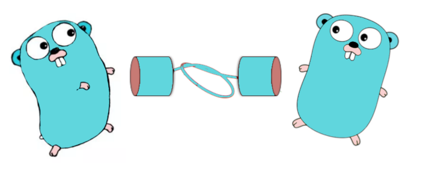
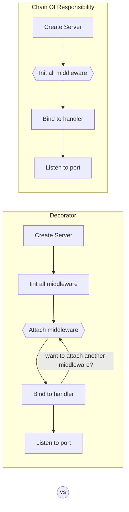

# Httpmiddleware

<p align="center">
  
</p>

HTTPMiddleware is a simple middleware wrapper library to make creating & attaching middleware to HTTP request router easier (for [httprouter](github.com/julienschmidt/httprouter) lib)  

In contrast to the usual style that wrap one by one like being proposed in [Gorilla handler](https://github.com/gorilla/handlers) which recommended by the httprouter lib when creating middleware, we setup the middleware first then wrap it to the http handler.

This is simply an opinion and preference for some user that prefer to use `chain of responsibility` middleware style rather than `decorator` middleware style. The new style is heavily inspired by [express JS middleware](https://expressjs.com/en/guide/using-middleware.html).

## Installation
```
go get -u github.com/William9923/httpmiddleware
```

## Difference



1. Decorator style (taken from gorilla/handlers repo)
```go
func main() {
    r := http.NewServeMux()

    // Only log requests to our admin dashboard to stdout
    r.Handle("/admin", handlers.LoggingHandler(os.Stdout, http.HandlerFunc(ShowAdminDashboard)))
    r.HandleFunc("/", ShowIndex)

    // Wrap our server with our gzip handler to gzip compress all responses.
    http.ListenAndServe(":8000", handlers.CompressHandler(r))
}
```
2. Chain of responsibility style
```go
func main() {

    // Group certain middleware
	middlewares := httpmiddleware.New()
	middlewares.Use(Logging)
	middlewares.Use(Authentication)
	middlewares.Use(Authorization)

    // Wrap router based on middleware
	router := httprouter.New()
	router.GET("/", middlewares.Wrap(Index))
	router.GET("/ping", ping)

	log.Fatal(http.ListenAndServe(":8080", router))
}

```

There are no exact and correct way on how to setup the middleware, feel free to pick based on your preference


